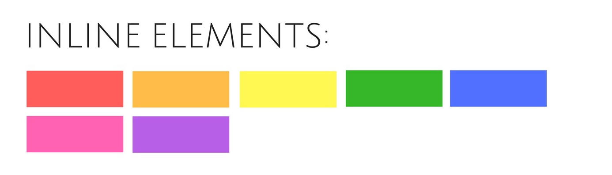

# Урок 02. Блочні та рядкові теги. Основні групи тегів.

План уроку.

1. ## Документація MDN https://developer.mozilla.org/
2. ## Блочні та рядкові теги. Шпаргалка https://htmlreference.io/
3. ## Основні групи елементів
   # -- Службові теги
   # -- Теги групування контенту
   # -- Списки
   # -- Посилання
   # -- Таблиці
   # -- Текстові елементи
   # -- Медіа файли
   # -- Форми

<!--!------------------ Блочні та рядкові теги ------------------------->

## Блочні та рядкові теги

Існує дві категорії HTML елементів, які відповідають типам їх вмісту і поведінці в структурі веб-сторінки - блочні та рядкові елементи.

-блочні (блокові) теги: 
, 
, <form>, <nav>, <ul>, <li>, <header>, <aside>, <main>, <footer>, <h1>

-рядкові теги: <a>, , <b>, <em>, <i>, <input>, .

<!--!------------------Основні групи елементі--------------------------->

## Основні групи елементі

Службові теги
Теги групування контенту
Списки
Посилання
Таблиці
Текстові елементи
Медіа файли
Форми

<!--todo------------------------------------------------------->

# -- Службові теги

Mістять здебільшого інформацію для браузерів та пошукових систем.

- <!doctype> - обов'язкова інструкція оголошення типу документа. Тобто таким чином браузер дізнається, якою мовою і з якими технологіями він був створений.

- <head> - у перекладі шапка. Mістить службову інформацію про документ.
  <title> - Встановлює заголовок на панелі інструментів браузера.
  <meta> - задає деякі службові команди браузеру або пошуковим системам.

  <!--todo------------------------------------------------------->

# Потік документа

Потік - це вертикальний і горизонтальний порядок відображення елементів на сторінці.

<!-- Абзац - це блоковий елемент -->

Блоковий елемент 1

Блоковий елемент 2

Блоковий елемент 3

<!--  -->

<!-- Посилання - це рядковий елемент -->

<a href="">Рядковий елемент 1</a>
<a href="">Рядковий елемент 2</a>
<a href="">Рядковий елемент 3</a>

<!--  -->

  <!--todo------------------------------------------------------->

# -- Теги групування контенту

 - універсальний блок
<header> - шапка сайту
<main> - основний контент сайту. Містить в собі, бокові колонки, статті, секції та інші блоки.
<aside> - бокова колонка (сайд)
<article> - використовується в блогах для позначення статей, передбачає наявність заголовка, та даних про автора, дату публікації та ін.
<section> - секція, часто використовується в односторінкових сайтах, передбачає наявність заголовка та підзаголовка
<footer> - підвал сайту, містить інформацію про авторство сайту, контактні дан та ін.

<!--todo------------------------------------------------------->

# -- Списки

Списки дозволяють упорядкувати колекції і представити їх в наочному і зручному для користувача вигляді. Список - це контейнер, дітьми якого можуть бути тільки елементи списку - теги <li>.
Тег <ol> - створює нумерований (упорядкований) список

<!-- нумерований (упорядкований) список -->
<h1>Як заварити чай</h1>

Покрокова інструкція для чайників, просто повтори і у тебе все вийде!

<ol>
  <li>Закип'ятити воду</li>
  <li>Засипати чай в чашку</li>
  <li>Налити в чашку окріп</li>
  <li>Чекати 10 хвилин, після чого можна пити</li>
</ol>

Тег <ul> - створює маркований (невпорядкований) список.

<!-- маркований (невпорядкований) список -->
<h1>Як заварити чай</h1>

Покрокова інструкція для чайників, просто повтори і у тебе все вийде!

<ol>
  <li>Закип'ятити воду</li>
  <li>Засипати чай в чашку</li>
  <li>Налити в чашку окріп</li>
  <li>Чекати 10 хвилин, після чого можна пити</li>
</ol>

<!--! УВАГА За специфікацією в теги <ul> і <ol> можна вкладати тільки елементи списку - теги <li>. Водночас, всередині тегів <li> можуть бути вкладені інші довільні теги. -->

<!--todo------------------------------------------------------->

# -- Посилання

Тег <a> - призначений для створення посилань, тексту, клікаючи на який, переходимо на іншу сторінку, завантажуємо файл тощо.

<!-- Посилання -->

<a href="https://google.com">Посилання на головну сторінку Google</a>

<!--todo------------------------------------------------------->

# -- Кнопка

Інтерактивний елемент, який оживляється за допомогою JavaScript. Наприклад, кнопка відкриття і закриття спливаючого вікна.

<!-- Кнопка -->

<button type="button">Відкрити модальне вікно</button>

<!--todo------------------------------------------------------->

# -- Таблиці

Таблиці

<table> - контейнер таблиці
<thead> - шапка таблиці
<th> - комірка шапки
<tbody> - тіло таблиці
<tfoot> - підвал таблиці
<tr> - окремий рядок
<td> - окрема комірка

<!-- Таблиці -->
<table>
  <caption>The Beatles</caption>
  <tr>
    <td>John Lennon</td>
    <td>Rhythm Guitar</td>
  </tr>
  <tr>
    <td>Paul McCartney</td>
    <td>Bass</td>
  </tr>
  <tr>
    <td>George Harrison</td>
    <td>Lead Guitar</td>
  </tr>
  <tr>
    <td>Ringo Starr</td>
    <td>Drums</td>
  </tr>
</table>

<!--todo------------------------------------------------------->

# -- Текстові елементи

Текстові елементи

1. Теги заголовка: <h1> ... <h6>
2. Теги для форматування тексту: <b>, <i>, <u>, <mark>, <small>, , 
3. Теги для введення комп'ютерного коду: <code>, <kbd>, <samp>, <var>, <pre>
4. Теги оформлення цитат: <abbr>, <bdo>, <blockquote>, <q>, <cite>, <dfn>
5. Абзаци та засоби переносу тексту на новий рядок:

   1. 
 - абзац
   2.   - перехід на новий рядок
   3. 
 - розділювач тесту (лінія)

      <!--todo------------------------------------------------------->

# -- Медіа файли

 - тег для вставки зображення в розмітку. Обов'язкові атрибути src (посилання на саме зображення) та alt (альтернативний текст на випадок, якщо зображення не завантажується).
<video> - додає та відтворює відеоролики на веб-сторінці
<audio> - так як і відео, тільки аудіо

  <!-- <iframe width="420" height="315" src="https://www.youtube.com/embed/tgbNymZ7vqY?controls=0">
  </iframe> -->

  <!-- <video src="" controls></video> -->
<!--todo------------------------------------------------------->

# -- Форми

<form> - контейнер для форми
<input> - поля форми
<select> - випадаючий список
<button> - кнопка

<form action="/signup" method="post">
  

    <label>Title</label> 
    <label>
      <input type="radio" name="title" value="mr">
      Mr
    </label>
    <label>
      <input type="radio" name="title" value="mrs">
      Mrs
    </label>
    <label>
      <input type="radio" name="title" value="miss">
      Miss
    </label>
  

  

    <label>First name</label> 
    <input type="text" name="first_name">
  

  

    <label>Last name</label> 
    <input type="text" name="last_name">
  

  

    <label>Email</label> 
    <input type="email" name="email" required>
  

  

    <label>Phone number</label> 
    <input type="tel" name="phone">
  

  

    <label>Password</label> 
    <input type="password" name="password">
  

  

    <label>Country</label> 
    <select>
      <option>China</option>
      <option>India</option>
      <option>United States</option>
      <option>Indonesia</option>
      <option>Brazil</option>
    </select>
  

  

    <label>
      <input type="checkbox" value="terms">
      I agree to the <a href="/terms">terms and conditions</a>
    </label>
  

  

    <button>Sign up</button>
    <button type="reset">Reset form</button>
  

</form>
